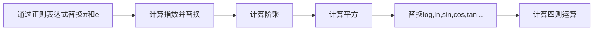

# Design Sheet

## 计算器基本元素：

### 运算数

- 0~10
- e 
- π

### 运算符

**常见计算**

- +-*/ ：直接插入

**指数计算**

- ²  ： 直接插入
- x^y ： 检查是否有数，如果有，先给出操作符加左括号，自己添加右括号
- exp ： 先给出操作符加左括号，自己添加右括号
- √  ：先给出操作符加左括号，自己添加右括号
- 1/x ：直接对表达式求值

**对数计算**

- log ：先给出操作符加左括号，自己添加右括号
- ln：先给出操作符加左括号，自己添加右括号

**三角计算**

- sin
- cos
- Tan
- Rad 弧度制和角度值切换

**阶乘：**直接对表达式求值

**百分数：**直接对表达式求值，计算数值的百分数

**随机数：**直接插入一个随机数

## 思路

### 整体流程

### 四则运算中操作符的优先级

| 1    | 2    | 3    | 4    |
| ---- | ---- | ---- | ---- |
| (    | ×,÷  | +，- | ）   |

### 基于栈的四则运算

