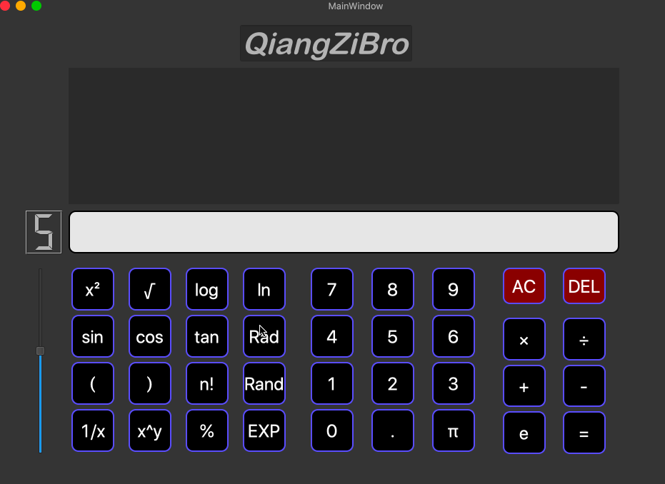

# 科学计算器的设计与实现

本项目实现了一个科学计算器，其特性有

- 三角函数，对数函数，指数函数，根号，平方，阶乘【重要：传入的数目前只允许是常数】
- 包含π，自然数e
- 

未来规划（如果有时间）：

- [x] 精度带滑动条调节 
- [x] 能看到历史计算信息 
- [ ] 实现复杂的嵌套，比如log(sin(3+1))

## 功能

### 键盘

| 快捷键            | 功能   |
| ----------------- | ------ |
| Shift +J或Shift+K | 下或上 |
| N                 | ln     |
| L                 | log    |

## 更新日志

- 2020-03-20 添加了键盘按键，能够上下调计算表达式

